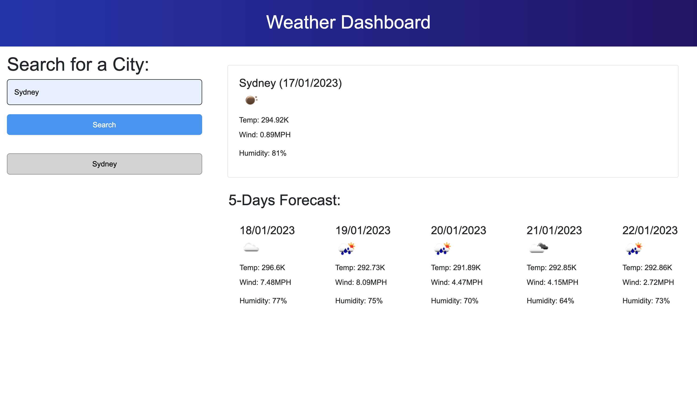

# Weather Dashboard

## Task

The aim of this project is to build a weather dashboard that will run in the browser and feature dynamically updated HTML and CSS.

In order to achieve the functionality of the webpage, I used [5 Day Weather Forecast](https://openweathermap.org/forecast5) to retrieve weather data for cities. The base URL should look like the following: `https://api.openweathermap.org/data/2.5/forecast?lat={lat}&lon={lon}&appid={API key}`.

In addition, I used `localStorage` to store any persistent data so that these data can be also accessible if you wish to go back to your previous search results.

User story and acceptance criteria are shown as below:

## User Story

```
AS A traveler
I WANT to see the weather outlook for multiple cities
SO THAT I can plan a trip accordingly
```

## Acceptance Criteria

```
GIVEN a weather dashboard with form inputs
WHEN I search for a city
THEN I am presented with current and future conditions for that city and that city is added to the search history
WHEN I view current weather conditions for that city
THEN I am presented with the city name, the date, an icon representation of weather conditions, the temperature, the humidity, and the wind speed
WHEN I view future weather conditions for that city
THEN I am presented with a 5-day forecast that displays the date, an icon representation of weather conditions, the temperature, the wind speed, and the humidity
WHEN I click on a city in the search history
THEN I am again presented with current and future conditions for that city
```

## Mock-Up

The following image shows the web application's appearance and functionality:



## Link

The deployed application can be accessible through the link below:
https://jasonyoo3026.github.io/weather-searching/
